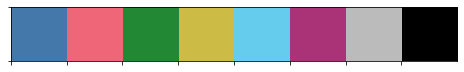
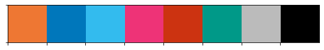
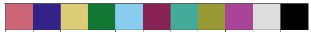
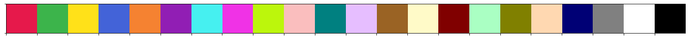
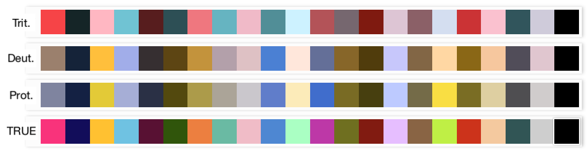

# colour palettes

colours are hard 😭

## Categorical

Colour palettes usually include white/grey/black as their own hues. 
They are not counted in the titles below.

### < 8 colours

Paul Tol has [a few palettes](https://personal.sron.nl/~pault/). I believe
they are optimised for contrast and colour-blindness. I like these:

**Bright**
```python
colors = ['#4477AA', '#EE6677', '#228833', '#CCBB44', '#66CCEE',
          '#AA3377', '#BBBBBB', '#000000']
```


**Vibrant**
```python
colors = ['#EE7733', '#0077BB', '#33BBEE', '#EE3377', '#CC3311',
          '#009988', '#BBBBBB', '#000000']
```


**Muted**
```python
colors = ['#CC6677', '#332288', '#DDCC77', '#117733', '#88CCEE',
          '#882255', '#44AA99', '#999933', '#AA4499', '#DDDDDD',
          '#000000']
```


### 20 colours

It turns out 20 colours is a lot and is quite hard to auto-generate 
with a tool to any appreciably differentiative degree.

There's [Sasha Trubetskoy's 20 simple colours](https://sashamaps.net/docs/tools/20-colors/):

```python
colors = ['#e6194b', '#3cb44b', '#ffe119', '#4363d8', '#f58231', 
          '#911eb4', '#46f0f0', '#f032e6', '#bcf60c', '#fabebe', 
          '#008080', '#e6beff', '#9a6324', '#fffac8', '#800000', 
          '#aaffc3', '#808000', '#ffd8b1', '#000075', '#808080', 
          '#ffffff', '#000000']
```



I combined these with Paul Tol's and twiddled around until they
looked ok. I have no idea how perceptually dissimilar this is, 
but I tried my best 🤷‍

```python
colors = ['#F9337B', '#120D5A', '#FFC131', '#2BC1E2', '#580E33', 
          '#095400', '#EC7F40', '#38B9A3', '#f0bcc7', '#0286D2', 
          '#aaffc3', '#BD38A7', '#6F6F20', '#800000', '#e6beff', 
          '#896444', '#bfef45', '#cc3311', '#f4c99f', '#225555',
          '#CECECE', '#000000']
```

Colour-blind (top 3) representations courtesy of [David Nichols' 
Coloring for Colorblindness tool](https://davidmathlogic.com/colorblind/#%23F9337B-%23120D5A-%23FFC131-%232BC1E2-%23580E33-%23095400-%23EC7F40-%2351DEC6-%23F0BCC7-%230286D2-%23AAFFC3-%23BD38A7-%236F6F20-%23800000-%23E6BEFF-%23896444-%23BFEF45-%23CC3311-%23F4C99F-%23225555-%23CECECE-%23000000):



* protanopia: 1% Caucasian males
* deuteranopia: 1% Caucasian males
* tritanopia: super rare, ~0%

[Stats from here.](https://disorders.eyes.arizona.edu/category/alternate-names/protanopia)

### More

More tools that can be used for auto-generation:

* the [Glasbey colour maps](https://colorcet.holoviz.org/user_guide/Categorical.html) (not colourblind-safe; you can engineer this by creating your own palettes with limited hues)
* [i want hue](https://medialab.github.io/iwanthue/): generate all sorts of colours. Can be colourblind safe.
